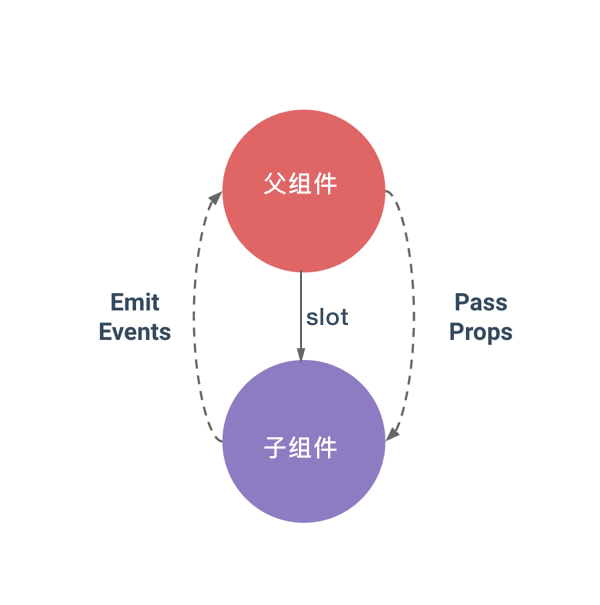

# VueJs进阶-如何编写高质量的插件
这是一套专门写给VueJS进阶者的教程，结合npm上高质量的vue插件源代码，深入理解VueJS编程思想，写出高质量的VueJS应用。


## 前言
如果你使用了一段时间vue，你一定会对他组件化方面的印象非常深刻，它的组织方式能让我们非常轻松的使用第三方组件库如[Element](http://element.eleme.io/)。但是插件和组件其实是不同的，实际上插件多数时候是组建的一种扩充。在写插件之前，至少要对组建有比较深刻的认识，一个单文件Vue组件大概长下面这个样子：

```javascript
<template>
  <div class="wrapper">
    {{textFromData}} {{textFromProps}}!
  </div>
</template>
<script>
  export default {
    name: 'demo',
    data () {
      return {
        textFromData: 'Hello'
      }
    },
    props: {
      textFromProps: {
        type: String
      }
    }
  }
</script>
<style>
.wrapper{
  color: #34495E;
}
</style>
```

## 预备知识
如果你已经非常熟悉，props，自定义事件和slot，可以跳过以下内容，直接实战。如果只是接触了一点Vue，那还是乖乖听我再说一遍吧！props，自定义事件和slot的设计是用于父子组件之间的通讯。简单理解如图



### Props
props是从父组件传递进来的数据，拿那个最简单的单文件Vue组件为例，props里面只有一个textFromProps，并且已经标注出类型为Srting。这就说明，textFromProps是需要从父组件传递进来，并且是一个字符串，你也可以在textFromProps里面加上`required: true`来标识为必要的属性。
有了props的定义，我们在父组件中就可以这样使用我们的组件了。

```html
<demo textFromProps="World"></demo>
```

### 自定义事件
自定义事件为的是解决，子组件与父组件通信的问题。当子组件内部改变的时候父组件可以做出相应的调整。

```javascript
<!-- 父组件 -->
<demo textFromProps="World" @myEvent="handleMyEvent"></demo>
<!-- 子组件 -->
在恰需要的时候使用this.$emit('myEvent')，触发handleMyEvent方法
```

### Slot（插槽）
使用插槽的意义在于，可以从父组件的标签中拿到内容，这对于子组件的可扩展性提供了非常大的帮助。
```javascript
<!-- 父组件 -->
<demo textFromProps="World" @myEvent="handleMyEvent">
  <p>这是slot中的内容</p>
</demo>
<!-- 子组件中 -->
<template>
  <div class="wrapper">
    {{textFromData}} {{textFromProps}}!
    <slot></slot>
  </div>
</template>
```
