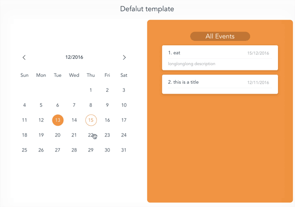
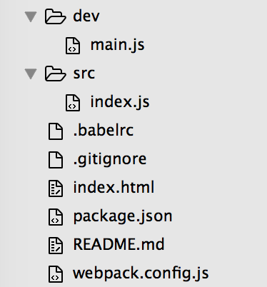

# VueJs进阶-如何编写高质量的插件
这是一套专门写给VueJS进阶者的教程，结合npm上高质量的vue插件源代码，深入理解VueJS编程思想，写出高质量的VueJS应用。

## 进入主题，codeing
>这次我们要编写的是一个日历组件，成品如图：

首先构建基本的Vue开发环境，我这里采用vue-cli，使用的模版是simple-webpack, 这是vue官方提供的简版webpack配置。我们删除掉src目录下的所有文件, 新建一个idnex.js。我们的目的是把src目录当作插件的源文件目录。再在根目录下创建dev文件夹，存放开发插件时所用文件，在此目录新建一个main.js作为js入口文件。修改webpack配置文件中 entry为 './dev/main.js'。这样一个基本的开发插件的环境就搭好了。如图：

我已经将代码放到我的GitHub仓库[vue-event-calendar](https://github.com/GeoffZhu/vue-event-calendar)。